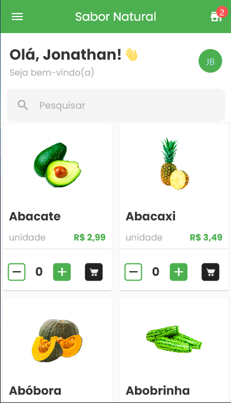
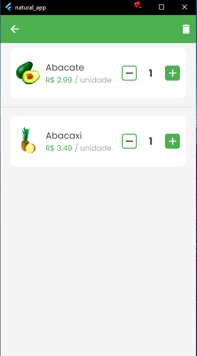

# Sabor Natural - Aplicativo de Hortifruti

## Descrição

O Sabor Natural é um aplicativo de hortifruti que permite aos usuários visualizar produtos disponíveis e adicionar itens ao carrinho de compras. O aplicativo foi desenvolvido em Flutter e utiliza a injeção de dependência Get It, o SharedPreferences para salvar produtos e o State Pattern para gerenciar o estado.

## Funcionalidades

- **Visualização de Produtos:** Os usuários podem navegar pelos produtos disponíveis, ver detalhes, preços e imagens dos produtos.

- **Adicionar ao Carrinho:** Os usuários podem adicionar produtos ao carrinho de compras.

- **Carrinho de Compras:** Os usuários podem visualizar os produtos que adicionaram ao carrinho de compras, bem como a quantidade e o total de compras.

## Capturas de Tela

- Tela inicial:
  

- Tela do carrinho:
  

## Em Desenvolvimento

O aplicativo Sabor Natural ainda está em fase de desenvolvimento. As próximas funcionalidades planejadas incluem:

- Tela de Login/Cadastro.
- Cadastro de Endereço.
- Filtros de Produtos.
- Remoção de Itens do Carrinho.
- Processo de Pagamento Pelo Aplicativo.

## Requisitos

Em breve

## Instalação

Em breve